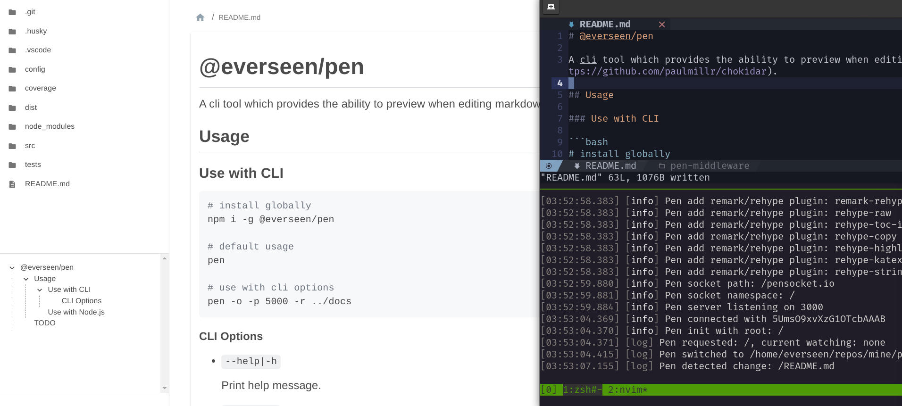

# @everseen/pen

A cli tool provides the ability to preview markdown files when editing, based on [socket.io](https://socket.io/) and [chokidar](https://github.com/paulmillr/chokidar), with builtin katex, highlight.js, copy, doctoc and vuepress style container support.



## Usage

### Use with CLI

```bash
# install globally
npm i -g @everseen/pen

# default usage
pen

# use with cli options
pen -o -p 5000 -r ../docs
```

#### CLI Options

+ `--help|-h`

    Print help message.

+ `--root|-r`

    Set watching directory, relative path to current dir, default `.`.

+ `--namespace|-n`

    Set socket.io namespace, default `/`.

+ `--port|-p`

    Set server port, default `3000` or another auto-detected avaliable port.

+ `--ignores|-i`

    Set ignoring files, default `[]`, for example if you want to ignore dotfiles: `-i "^\\."`

+ `--silent|-s`

    Ignore logger messages, default `false`.

+ `--open|-o`

    Open browser automatically, default `false`.

+ `--theme|-T`

    Select theme, `dark` or `light`.

+ `--socketPath|-S`

    Set socket.io path, default `/pensocket.io`.

### Use with Node.js

Check [cli.js](./cli.js) and [server/index.ts](./src/server/index.ts) as an example.

## Q & A

1. The UI looks ugly, how to customize theme?

    My fault🐶, fork this project and rewrite the client part, this is a small project!.

2. Error when using namespace `/xxx` in git bash on windows?

    Try Power Shell, seems namespace `/doc` will be translate to `/D:/<pwd>/doc` in git bash.

3. I want some markdown graph tools?

    Originally, I considered integrating [mermaid](https://mermaid-js.github.io/mermaid/#/) or [graphviz](https://graphviz.org/), but finnaly I gave up since they all required additional effort and time to learn. (And will not display without support from a tool, unlike Latex/Tex, which is widely used). I now use online tools like [excalidraw](https://excalidraw.com/) for image demands.

**PRs and issues are welcomed!**

## TODO

1. add more test cases
2. upgrade to MUI@5
