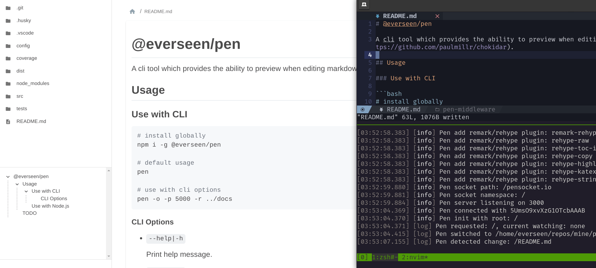
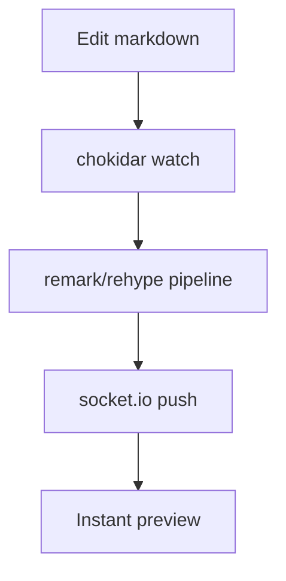

# @everseen/pen

A cli tool to preview markdown files while editing.



## Requirements

+ Node.js >= 20.19

## Usage

```bash
# install globally
npm i -g @everseen/pen

# serve the current directory
pen

# or with options
pen -o -p 5000 -r ../docs
```

### CLI Options

| Option | Default | Description |
| --- | --- | --- |
| `--help` `-h` | | Print help message |
| `--root` `-r` | `.` | Watching directory, relative to current dir |
| `--namespace` `-n` | `/` | socket.io namespace |
| `--port` `-p` | `3000` | Server port, or the next auto-detected available one |
| `--ignores` `-i` | `[]` | Ignored files, e.g. `-i "^\\."` for dotfiles |
| `--silent` `-s` | `false` | Suppress logger messages |
| `--open` `-o` | `false` | Open the browser automatically |
| `--socketPath` `-S` | `/pensocket.io` | socket.io path |

Use with Node.js: see [cli.mjs](./cli.mjs) and [server/index.ts](./src/server/index.ts).

## Syntax

Beyond standard GFM, pen renders:

### Math

Inline math $e^{i\pi} + 1 = 0$ flows with the text, block math gets its own
display:

$$
\int_{-\infty}^{\infty} e^{-x^2} \, dx = \sqrt{\pi}
$$

### Mermaid Diagram

Mermaid blocks are drawn lazily on the client, following the current
light/dark theme:


```mermaid
graph TD;
  edit[Edit markdown]-->watch[chokidar watch];
  watch-->render[remark/rehype pipeline];
  render-->push[socket.io push];
  push-->browser[Instant preview];
```

### Containers

Directive containers render as callouts — `info`, `warn` and `error`:

:::info
A neutral note. The CLI defaults to port 3000 and falls back to the next free
port when taken.
:::

:::warn
Windows git bash mangles namespaces like `/doc` into `/D:/<pwd>/doc` — use
Power Shell if you hit this.
:::

:::error
An error-styled callout for failures worth shouting about.
:::

### Code Hosts

Fenced code gets lowlight highlighting plus a language tag that copies the
block on click:

```ts
import { createServer } from 'node:http';

const server = createServer((req, res) => {
  res.writeHead(200, { 'content-type': 'text/plain' });
  res.end('hello from pen\n');
});

server.listen(3000);
```

### 中文标题（CJK anchors）

标题锚点是 github 风格 slug，**中文字符原样保留**——侧边栏目录可跳转，滚动时高亮跟随。

### Raw HTML

Inline HTML passes through (rehype-raw), so `<details>` works:

<details>
<summary>Click to expand</summary>

Hidden content.

</details>

**PRs and issues are welcomed!**
