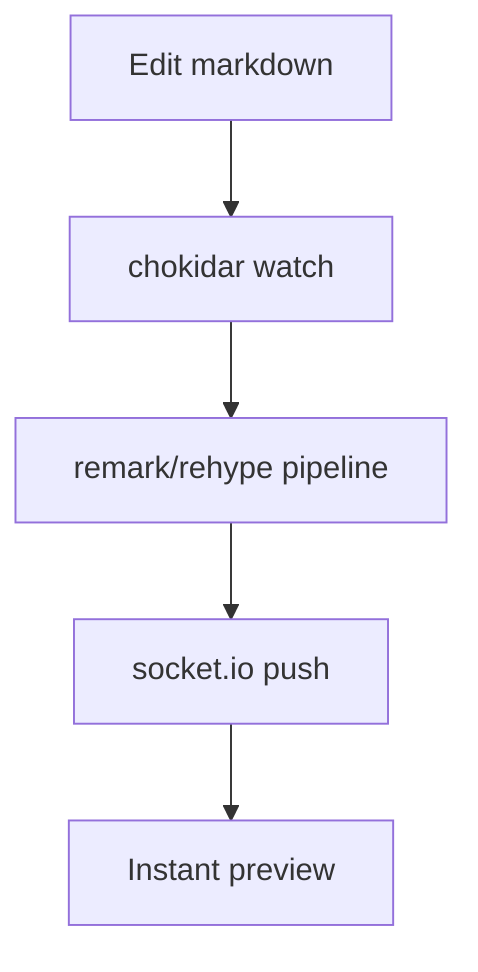

# @everseen/pen

A cli tool to preview markdown files while editing — this README doubles as a
living tour of every syntax pen supports. Browse it with `pen` and watch each
section render: the sidebar builds a table of contents from the headings,
anchors scroll with scrollspy, code blocks get highlight + copy buttons, math
and mermaid render in place.


## Requirements

+ Node.js >= 20.19

## Usage

```bash
# install globally
npm i -g @everseen/pen

# serve the current directory
pen

# or with options
pen -o -p 5000 -r ../docs
```

### CLI Options

| Option | Default | Description |
| --- | --- | --- |
| `--help` `-h` | | Print help message |
| `--root` `-r` | `.` | Watching directory, relative to current dir |
| `--namespace` `-n` | `/` | socket.io namespace |
| `--port` `-p` | `3000` | Server port, or the next auto-detected available one |
| `--ignores` `-i` | `[]` | Ignored files, e.g. `-i "^\\."` for dotfiles |
| `--silent` `-s` | `false` | Suppress logger messages |
| `--open` `-o` | `false` | Open the browser automatically |
| `--socketPath` `-S` | `/pensocket.io` | socket.io path |

Use with Node.js: see [cli.mjs](./cli.mjs) and [server/index.ts](./src/server/index.ts).

## Syntax Tour

### Emphasis & Inline

**bold**, *italic*, ***bold italic***, ~~strikethrough~~, `inline code`,
a [link](https://github.com/EverSeenTOTOTO/pen-middleware), a bare autolink
<https://socket.io>, and a footnote[^note].

[^note]: Footnotes come from GFM; pen renders them at the end of the document.

### Lists

1. ordered item
2. another one
   - nested unordered
   - sibling
3. back to ordered

- [ ] task: unchecked
- [x] task: done

### 中文标题（CJK anchors）

标题会生成可读的 github 风格锚点，**中文字符原样保留**——点击侧边栏目录或标题旁的锚点链接即可跳转，滚动时目录高亮跟随（scrollspy）。

### Blockquote

> Quote level one.
>
> > Quote nested — with `code` and **emphasis** inside.

### Table

| Feature | Engine | Notes |
| :--- | :--- | ---: |
| GFM tables / tasks | remark-gfm | this table |
| Math | remark-math + rehype-katex | below |
| Diagrams | mermaid (lazy, client side) | below |
| Containers | remark-directive | `:::info` etc. |

### Code Highlight & Copy

Fenced code gets syntax highlighting and a copy button on the host:

```ts
import { createServer } from 'node:http';

// highlight.js via lowlight, github theme
const server = createServer((req, res) => {
  res.writeHead(200, { 'content-type': 'text/plain' });
  res.end('hello from pen\n');
});

server.listen(3000);
```

### Math

Inline math $e^{i\pi} + 1 = 0$ flows with the text, block math gets its own
display:

$$
\int_{-\infty}^{\infty} e^{-x^2} \, dx = \sqrt{\pi}
$$

### Mermaid Diagram

Mermaid blocks are marked at render time and drawn lazily on the client,
following the current light/dark theme:


```mermaid
graph TD;
  edit[Edit markdown]-->watch[chokidar watch];
  watch-->render[remark/rehype pipeline];
  render-->push[socket.io push];
  push-->browser[Instant preview];
```

### Containers

Directive containers render as callouts — `info`, `warn` and `error`:

:::info
A neutral note. The CLI defaults to port 3000 and falls back to the next free
port when taken.
:::

:::warn
Windows git bash mangles namespaces like `/doc` into `/D:/<pwd>/doc` — use
Power Shell if you hit this.
:::

:::error
An error-styled callout for failures worth shouting about.
:::

### Raw HTML & Details

Rehype-raw passes inline HTML through, so `<details>` works:

<details>
<summary>Click to expand</summary>

Hidden content, including a list:

- one
- two

</details>

### Horizontal Rule

---

**PRs and issues are welcomed!**
