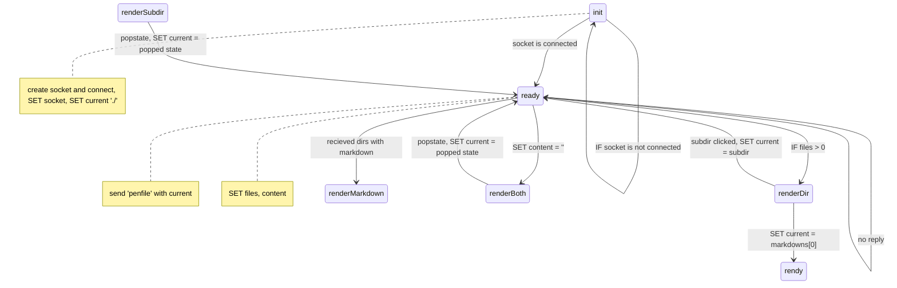

# state chart

每一次store变化（SET）都会调用dispatch变更state，进入每一个state时都会机械地执行既定逻辑，这些逻辑可能改变store，从而触发下一次状态变更（下一次“机械执行”）。

```mermaid
stateDiagram-v2
  init --> init: IF socket is not connected
  note right of init
    create socket and connect, SET socket, SET current './'
  end note
  init --> ready: socket is connected
  note right of ready
    send 'penfile' with current
  end note
  ready --> ready: no reply
  note right of ready
    SET files, content
  end note
  ready --> renderDir: IF files > 0
  renderDir --> ready: subdir clicked, SET current = subdir
  ready --> renderMarkdown: recieved dirs with markdown
  renderDir --> rendy: SET current = markdowns[0]
  ready --> renderBoth: SET content = ''
  renderBoth --> ready: popstate, SET current = popped state
  renderSubdir --> ready: popstate, SET current = popped state
```
